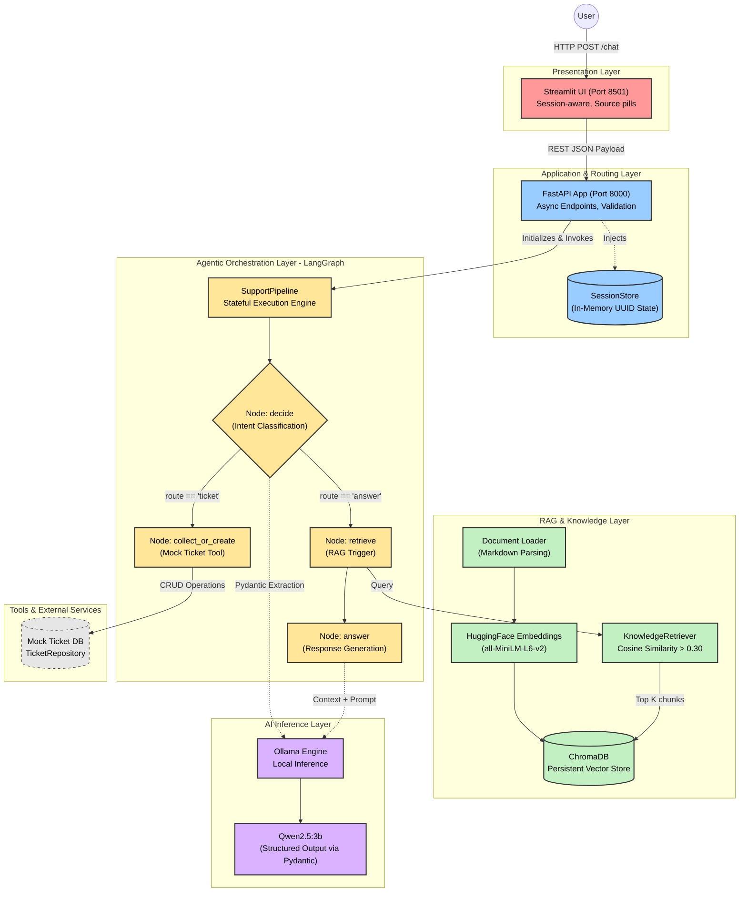

# Customer Support Ticket Agent

A text-based customer support agent that answers policy questions using a RAG knowledge base and collects information to raise support tickets through a multi-turn conversation. Built with FastAPI, Streamlit, LangGraph, ChromaDB, and an open-source LLM served locally via Ollama.

---

## System Architecture & Technical Design

The system employs a decoupled, microservices-inspired architecture, separating the presentation layer from the AI orchestration and retrieval layers. Below is a detailed sequence and component architecture diagram.



### Detailed Component Breakdown

#### 1. Presentation Layer (Streamlit)
- **Role:** Handles user interactions, maintains session persistence via UUIDs, and handles HTTP connection errors gracefully.
- **Data Flow:** Sends JSON payloads containing `session_id` and `message` to the FastAPI backend. Displays RAG source citations (source pills) and dynamic ticket UI forms upon ticket generation.

#### 2. Application & Routing Layer (FastAPI)
- **Role:** Serves as the asynchronous RESTful backend bridging the UI and the AI Orchestrator. 
- **Tech Setup:** Uvicorn ASGI server running asynchronous endpoints. Implements rigorous request payload validation using Pydantic.
- **Dependency Injection:** Injects `KnowledgeRetriever`, `SessionStore`, and `TicketRepository` into the agentic pipeline during initialization.

#### 3. Agentic Orchestration (LangGraph)
- **Role:** A cyclic, node-based state machine that prevents linear constraints.
- **Technical Flow:**
  - **`decide` node:** Uses LLM structural output (forcing a schema response) to classify the user's intent into either a pure query (`route="answer"`) or a support ticket request (`route="ticket"`).
  - **`retrieve` node:** Triggers the Knowledge Retriever if the context is needed.
  - **`answer` node:** Synthesizes the final contextually aware response.
  - **`collect_or_create` node:** Handles multi-turn workflows by checking for missing ticket fields. If complete, it prevents duplicates and securely logs the ticket via `TicketRepository`.

#### 4. Retrieval-Augmented Generation (RAG) Layer
- **Ingestion Strategy:** Markdown files are parsed via a custom `document_loader.py`.
- **Vector Operations:** Uses `sentence-transformers/all-MiniLM-L6-v2` for generating embeddings, achieving a balance between speed and precision.
- **Persistence & Searching:** Embeddings are saved to a local **ChromaDB**. 
- **Anti-Hallucination Guardrails:** The `KnowledgeRetriever.search()` enforces a strict cosine similarity threshold (`0.30`). Queries returning scores beneath this bound are safely intercepted, prompting the agent to admit missing information rather than hallucinating.

#### 5. Local Inference Layer (Ollama)
- **Role:** Executes text generation and semantic reasoning.
- **Tech Setup:** Connects securely via `langchain-openai` integration pointing to `http://localhost:11434/v1`. Runs **Qwen2.5:3b** locally, enforcing 100% data privacy with zero external API dependencies.

---

## Technology Stack

| Component | Library | Version |
|-----------|---------|---------|
| API | FastAPI + Uvicorn | ≥0.115 / ≥0.30 |
| UI | Streamlit | ≥1.40 |
| LLM client | langchain-openai (ChatOpenAI) | ≥0.3 |
| Agent framework | LangGraph | ≥0.2 |
| Vector store | ChromaDB | ≥0.5 |
| Embeddings | sentence-transformers/all-MiniLM-L6-v2 | ≥3.0 |
| LLM | Qwen2.5:3b (default) via Ollama | any |
| **STT** | **faster-whisper** (local Whisper, CPU, int8) | **≥1.0** |
| **TTS** | **edge-tts** (Microsoft Edge Neural voices, free) | **≥6.1** |

> **LLM note:** Any OpenAI-compatible endpoint serving an open-source
> instruction-tuned model works. The default is Qwen2.5:3b via Ollama.
> No proprietary/closed model API is used.

> **Voice note:** Both STT (faster-whisper) and TTS (edge-tts) are free.
> faster-whisper requires no API key and runs fully offline.
> edge-tts uses Microsoft Edge's neural voices (network needed for TTS only).
> Neither uses any prohibited platform (Pipecat, LiveKit, Agora, etc.).

---

## Requirements

- **Python 3.12** or newer (3.11+ works too)
- **Ollama** (or equivalent OpenAI-compatible local inference endpoint)
- ~500 MB disk space for the embedding model (downloaded once on first run)
- ~2 GB RAM for Qwen2.5:3b
- **Internet connection** required only for edge-tts synthesis (one request per TTS call)

---

## Setup

### Step 1 — Install Ollama and pull the model

Download Ollama from https://ollama.com and then:

```sh
ollama pull qwen2.5:3b
```

> **Alternative:** Any OpenAI-compatible endpoint (LM Studio, vLLM, Together AI
> with an open-source model) can be used by setting `LLM_BASE_URL` and
> `LLM_MODEL` in `.env`.

### Step 2 — Create a Conda environment

First, navigate into the project directory:
```sh
cd customer_support_ticket_agent_E23CSEU1167_SHUBHAM_PANDEY
```

Then create and activate the Conda environment:
```sh
conda create -n ai_agent python=3.12 -y
conda activate ai_agent
```

### Step 3 — Install dependencies

Make sure your Conda environment is activated, then run:
```sh
pip install --upgrade pip
pip install -r requirements.txt
```

### Step 4 — Configure environment

#### Windows (PowerShell)
```powershell
Copy-Item .env.example .env
```

#### Linux / macOS
```sh
cp .env.example .env
```

Edit `.env` and set your values. **Never commit `.env` with real secrets.**

---

## Environment Variables

| Variable | Default | Description |
|----------|---------|-------------|
| `LLM_BASE_URL` | `http://localhost:11434/v1` | OpenAI-compatible endpoint URL |
| `LLM_API_KEY` | `not-required` | API key (use `not-required` for Ollama) |
| `LLM_MODEL` | `qwen2.5:3b` | Model name to use |
| `API_BASE_URL` | `http://localhost:8000` | Used by Streamlit to reach FastAPI |
| `API_HOST` | `127.0.0.1` | FastAPI bind address |
| `API_PORT` | `8000` | FastAPI port |
| `STREAMLIT_HOST` | `127.0.0.1` | Streamlit bind address |
| `STREAMLIT_PORT` | `8501` | Streamlit port |
| `VECTOR_DB_PATH` | `.data/vector_db` | ChromaDB persistence directory |
| `EMBEDDING_MODEL` | `sentence-transformers/all-MiniLM-L6-v2` | HuggingFace embedding model |
| `RAG_COLLECTION` | `customer-support` | ChromaDB collection name |
| `RAG_TOP_K` | `3` | Number of chunks to retrieve per query |

---

## Running the Application

Before running the commands below, make sure you are inside the project folder (`cd customer_support_ticket_agent_E23CSEU1167_SHUBHAM_PANDEY`) and your Conda environment is activated (`conda activate ai_agent`) in **both** terminals.

Start the API server first, then the UI in a separate terminal.

### Terminal 1 — FastAPI backend

#### Linux / macOS
```sh
uvicorn src.api.server:app --reload --host ${API_HOST:-127.0.0.1} --port ${API_PORT:-8000}
```

#### Windows (PowerShell)
```powershell
uvicorn src.api.server:app --reload --host 127.0.0.1 --port 8000
```

The API docs are available at `http://localhost:8000/docs`.

### Terminal 2 — Streamlit UI

#### Linux / macOS
```sh
streamlit run streamlit_app.py --server.address ${STREAMLIT_HOST:-127.0.0.1} --server.port ${STREAMLIT_PORT:-8501}
```

#### Windows (PowerShell)
```powershell
streamlit run streamlit_app.py --server.address 127.0.0.1 --server.port 8501
```

Open `http://localhost:8501` in your browser.

---

## Running Tests

```sh
pytest -v
```

The test suite runs without a running API server or LLM — it uses mocks and
the local ChromaDB with real embeddings for retriever tests.

> **Note:** The retriever integration tests (`test_retriever.py`) download the
> embedding model (~90 MB) on first run. Subsequent runs use the local cache.

---

## Voice Features (Mid-Session Extension)

### STT — Speech-to-Text

| Detail | Value |
|--------|-------|
| Provider | `faster-whisper` (local Whisper, no API key) |
| Model | `base` (CPU, int8 quantised — ~145 MB) |
| API endpoint | `POST /voice/transcribe` |
| Input | Any audio file (wav, webm, mp3, ogg) |
| Prohibited platforms used | **None** |

Flow:
1. User clicks the 🎤 microphone in Streamlit and records.
2. Audio bytes are sent to `POST /voice/transcribe`.
3. Whisper returns the transcript.
4. Transcript appears in an **editable text area** — user can correct mistakes.
5. User clicks **✅ Submit Transcript** to send through the normal `POST /chat` pipeline.
6. Text, session, RAG, and ticket workflows are completely unchanged.

### TTS — Text-to-Speech

| Detail | Value |
|--------|-------|
| Provider | `edge-tts` (Microsoft Edge Neural TTS, free) |
| Voice | `en-US-JennyNeural` (neural, natural-sounding) |
| API endpoint | `POST /voice/synthesize` |
| Output | `audio/mpeg` bytes |
| Prohibited platforms used | **None** |

Flow:
1. Every agent response in the chat displays a **🔊 Listen** button.
2. Clicking it calls `POST /voice/synthesize` with the message text.
3. Audio is cached in session state — replayed without a second API call.
4. Audio plays inline under the corresponding message only.
5. If TTS fails, the **text response is preserved** — no data loss.

### New API Endpoints

```sh
# Transcribe an audio file
curl -X POST http://localhost:8000/voice/transcribe \
  -F 'file=@recording.wav'

# Synthesize speech
curl -X POST http://localhost:8000/voice/synthesize \
  -H 'Content-Type: application/json' \
  -d '{"message_id":"msg-1","text":"Ticket CST-2026-0001 has been created."}'
```

Full API docs with voice endpoints: `http://localhost:8000/docs`

---

## Manual API Testing

### Check health
```sh
curl http://localhost:8000/health
```

### Send a chat message (Linux / macOS)
```sh
curl -X POST http://localhost:8000/chat \
  -H 'Content-Type: application/json' \
  -d '{"session_id":"demo-1","message":"How long does standard shipping take?"}'
```

### Windows PowerShell equivalent
```powershell
Invoke-RestMethod -Method POST -Uri http://localhost:8000/chat `
  -ContentType 'application/json' `
  -Body '{"session_id":"demo-1","message":"How long does standard shipping take?"}'
```

You can also use the interactive `/docs` interface at `http://localhost:8000/docs`.

---

## Knowledge Base

The four supplied Markdown documents in `knowledge_base/`:

| File | Topic |
|------|-------|
| `shipping.md` | Standard and express delivery times |
| `payments.md` | Duplicate charges and payment issues |
| `returns.md` | Return window and refund timeline |
| `accounts.md` | Password reset and account security |

---

## Tech Stack Substitutions and Deviations

See [`DECISIONS.md`](./DECISIONS.md) for the full rationale behind every
architectural decision, including:

- Why `build_support_workflow` was extended to accept dependency parameters
- The "mid-session requirement" interpretation (not defined in the main guide)
- Voice provider choices (faster-whisper for STT, edge-tts for TTS)
- Relevance threshold of 0.30 for "not in KB" detection

---

## Troubleshooting

| Symptom | Likely cause | Fix |
|---------|-------------|-----|
| `GET /health` returns 503 | Retriever initialisation failed (model not downloaded or ChromaDB error) | Check terminal logs; ensure `VECTOR_DB_PATH` is writable |
| LLM calls time out | Ollama not running, or wrong `LLM_BASE_URL` | Run `ollama serve` and `ollama pull qwen2.5:3b` |
| "Cannot connect to backend" in UI | FastAPI not running | Start `uvicorn` in a separate terminal |
| Duplicate chunks warning | Normal on cold start; second run is fast | Idempotent by design — safe to ignore |
| Embedding model downloads slowly | First-run behaviour | Downloads once and caches locally |
| 🎤 Mic not recording | Browser permissions | Allow microphone access in browser settings |
| Transcription slow on first use | Whisper model (~145 MB) downloading | Wait ~1 min on first transcription; cached after |
| 🔊 TTS fails with network error | edge-tts needs internet | Check network connection; text response is still shown |
| `POST /voice/transcribe` returns 422 | Empty audio file | Record audio before submitting |

