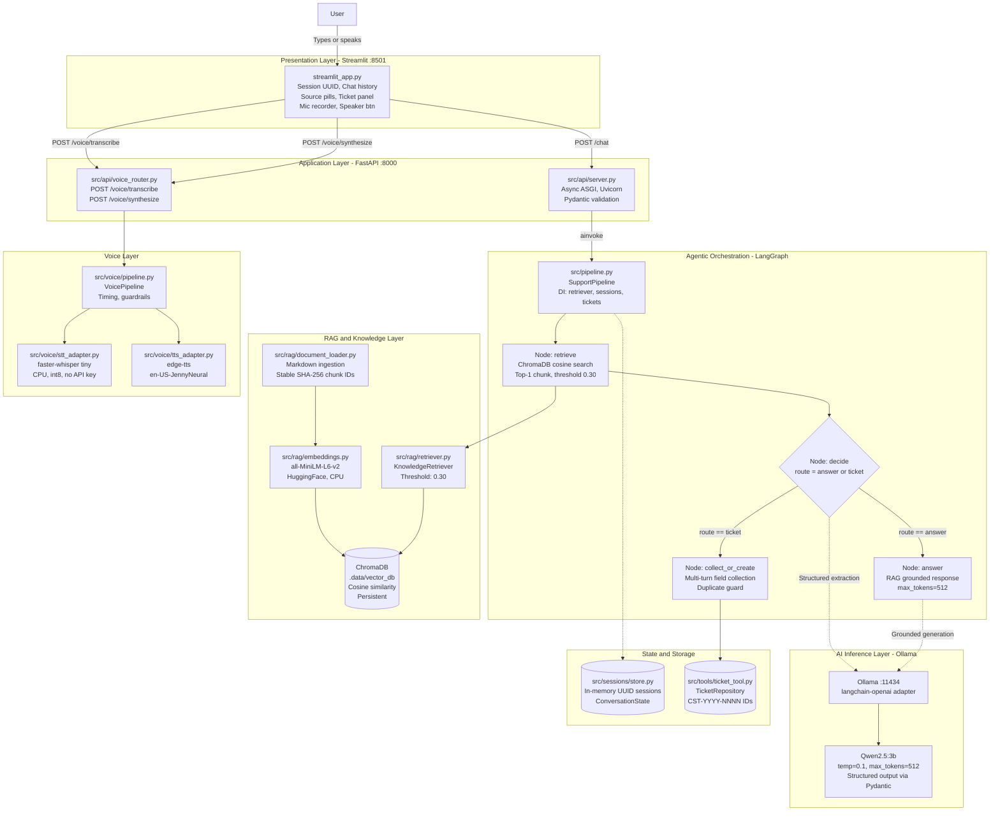

# Customer Support Ticket Agent
### E23CSEU1167 - Shubham Pandey

> A fully local, privacy-first AI customer support agent that answers policy questions via **RAG**, raises support tickets through **multi-turn conversation**, and supports **voice input (STT) + voice playback (TTS)** - all without any external API keys.

---

## System Architecture

The system is a **decoupled, microservices-style** pipeline with distinct layers communicating over REST and in-process async calls.



---

## Request Data Flow

```
User types/speaks  -->  Streamlit UI
  |
  |--[Voice] POST /voice/transcribe  -->  faster-whisper  -->  editable transcript
  |              User edits  -->  confirms  -->  text passed to next step
  |
  +--[Text/Confirmed]  -->  POST /chat  {session_id, message}
        |
        v
    FastAPI validates (Pydantic)  -->  SupportPipeline.process()
        |
        v
    LangGraph START
        |
        |-- Node: retrieve
        |    +-- KnowledgeRetriever.search(message)
        |         +-- ChromaDB cosine similarity (top-1, threshold > 0.30)
        |
        |-- Node: decide (LLM call #1)
        |    +-- Qwen2.5:3b structured output {route, customer_name, email, ...}
        |         |-- route = "answer"  -->  Node: answer
        |         +-- route = "ticket"  -->  Node: collect_or_create
        |
        |-- Node: answer (LLM call #2, only on route=answer)
        |    +-- Context (1 chunk, max 600 chars) + short prompt
        |         --> Qwen2.5:3b --> grounded text response
        |
        +-- Node: collect_or_create (no LLM call)
             |-- Check session.ticket_id (idempotency guard)
             |-- Merge extracted fields into ConversationState
             |-- If fields missing --> ask follow-up question
             +-- If all fields present --> TicketRepository.create() --> ticket_id
        |
        v
    LangGraph END  -->  FastAPI  -->  ChatResponse {response, sources, ticket_id}
        |
        v
    Streamlit renders:
        |-- Agent text response
        |-- Source pills (RAG citations)
        |-- Ticket confirmation box (if ticket created)
        +-- Listen button --> POST /voice/synthesize --> edge-tts --> audio playback
```

---

## Technology Stack

| Layer | Component | Library / Tool | Version |
|-------|-----------|----------------|---------|
| Frontend | Chat UI | Streamlit | >=1.40 |
| Backend API | REST Server | FastAPI + Uvicorn | >=0.115 / >=0.30 |
| Validation | Schema | Pydantic v2 | >=2.9 |
| HTTP Client | UI to API | httpx | >=0.27 |
| Orchestration | Agent Graph | LangGraph | >=0.2 |
| LLM | Local Inference | Ollama + Qwen2.5:3b | any |
| LLM Adapter | LangChain | langchain-openai | >=0.3 |
| Embeddings | Sentence BERT | all-MiniLM-L6-v2 | >=3.0 |
| Vector Store | RAG DB | ChromaDB (persistent, cosine) | >=0.5 |
| STT | Speech-to-Text | faster-whisper (tiny, CPU, int8) | >=1.0 |
| TTS | Text-to-Speech | edge-tts (en-US-JennyNeural) | >=6.1 |
| Testing | Test Runner | pytest + pytest-asyncio | >=8 / >=0.24 |

---

## Prerequisites

Before cloning and running, make sure you have:

| Requirement | Why | Install |
|-------------|-----|---------|
| **Python 3.12** | Project target version | [python.org](https://python.org) |
| **Conda / Miniconda** | Environment management | [docs.conda.io](https://docs.conda.io) |
| **Ollama** | Local LLM inference engine | [ollama.com](https://ollama.com) |
| **Git** | Clone the repo | [git-scm.com](https://git-scm.com) |
| **~3 GB free RAM** | For Qwen2.5:3b model | - |
| **~700 MB disk** | Embeddings + Whisper models | - |
| **Internet** | First-run model downloads + edge-tts | - |

---

## Complete Setup Guide

### Step 1 - Clone the Repository

```sh
git clone https://github.com/ShubhamPandey020525/customer_support_ticket_agent_E23CSEU1167_SHUBHAM_PANDEY.git
cd customer_support_ticket_agent_E23CSEU1167_SHUBHAM_PANDEY
```

---

### Step 2 - Install and Start Ollama

1. Download and install Ollama from **https://ollama.com**
2. Make sure Ollama is running (it starts automatically after install on most systems)
3. Pull the LLM model:

```sh
ollama pull qwen2.5:3b
```

> This downloads ~2 GB once. Subsequent startups are instant.

Verify Ollama is running:

```sh
ollama list
# Should show: qwen2.5:3b
```

---

### Step 3 - Create Conda Environment

```sh
conda create -n support_agent python=3.12 -y
conda activate support_agent
```

> Every terminal you open must run `conda activate support_agent` before any project commands.

---

### Step 4 - Install Python Dependencies

```sh
pip install --upgrade pip
pip install -r requirements.txt
```

> First install takes 3-5 minutes (downloads PyTorch, sentence-transformers, etc.)

---

### Step 5 - Configure Environment Variables

**Windows (PowerShell):**

```powershell
copy .env.example .env
```

**Linux / macOS:**

```sh
cp .env.example .env
```

The default `.env` works out of the box with Ollama on localhost. Edit it only if you use a different model or port.

| Variable | Default | Change if |
|----------|---------|-----------|
| `LLM_BASE_URL` | `http://localhost:11434/v1` | Using LM Studio or another provider |
| `LLM_MODEL` | `qwen2.5:3b` | Using a different Ollama model |
| `LLM_API_KEY` | `not-required` | Using a provider that needs a key |
| `VECTOR_DB_PATH` | `.data/vector_db` | Want to store DB elsewhere |
| `API_PORT` | `8000` | Port 8000 is taken |
| `STREAMLIT_PORT` | `8501` | Port 8501 is taken |

> **Never commit your `.env` file.** It is already in `.gitignore`.

---

### Step 6 - Run the Application

You need **two separate terminals**, both with the conda environment activated.

**Terminal 1 - Start the FastAPI Backend:**

```sh
conda activate support_agent
uvicorn src.api.server:app --reload --host 127.0.0.1 --port 8000
```

Wait until you see:

```
INFO:     Application startup complete.
```

**Terminal 2 - Start the Streamlit UI:**

```sh
conda activate support_agent
streamlit run streamlit_app.py --server.address 127.0.0.1 --server.port 8501
```

Open your browser at: **http://localhost:8501**

---

### Step 7 - Verify Everything is Working

Run this health check:

```sh
curl http://localhost:8000/health
# Expected: {"status": "ready"}
```

View all API endpoints (Swagger UI):

```
http://localhost:8000/docs
```

---

## Running Tests

```sh
conda activate support_agent
pytest -v
```

The test suite covers:

- RAG retrieval with real ChromaDB + fake embeddings
- LangGraph node logic with mocked LLM
- Voice pipeline (STT + TTS) with fake adapters
- FastAPI endpoint contracts
- Ticket creation and deduplication
- Empty audio / no-speech error handling

> **Note:** First run downloads the embedding model (~90 MB). Subsequent runs use local cache.

---

## Voice Features

### Microphone Input (STT)

1. Click the microphone control in the UI
2. Speak your question
3. Wait for transcription (faster-whisper tiny model, ~1-3 sec on CPU)
4. **Edit the transcript** if needed in the text box
5. Click **Submit Transcript** - your message goes through the normal chat pipeline

### Speaker Playback (TTS)

- Every agent response has a **Listen** button
- Click it to generate and play audio (Microsoft Edge Neural voice, `en-US-JennyNeural`)
- Audio is **cached per message** - replays instantly without a second API call
- If TTS fails (e.g., no internet), the **text response is always preserved**

### Voice API Endpoints

```sh
# Transcribe audio
curl -X POST http://localhost:8000/voice/transcribe \
  -F "file=@recording.wav"

# Synthesize speech
curl -X POST http://localhost:8000/voice/synthesize \
  -H "Content-Type: application/json" \
  -d '{"message_id": "msg-1", "text": "Your ticket has been created."}'
```

---

## What Can You Ask?

| Intent | Example | What Happens |
|--------|---------|--------------|
| Policy question | "How long does standard shipping take?" | RAG retrieves from `shipping.md`, grounded answer shown with source pill |
| Returns question | "What is your refund policy?" | RAG retrieves from `returns.md` |
| Raise a ticket | "I was double charged on my order" | Agent collects name, email, category, creates ticket `CST-YYYY-NNNN` |
| Out-of-scope | "What is the weather today?" | Agent politely admits it cannot help, offers alternatives |
| Greeting | "Hello!" | Friendly welcome response |

---

## Project Structure

```
customer_support_ticket_agent_E23CSEU1167_SHUBHAM_PANDEY/
|
|-- streamlit_app.py              # Frontend UI (chat + voice)
|-- requirements.txt              # All Python dependencies
|-- .env.example                  # Template for environment config
|
|-- src/
|   |-- api/
|   |   |-- server.py             # FastAPI app + lifespan startup
|   |   +-- voice_router.py       # POST /voice/transcribe and /synthesize
|   |-- llm/
|   |   |-- client.py             # ChatOpenAI -> Ollama adapter
|   |   |-- prompts.py            # System prompt + answer template
|   |   +-- workflow.py           # LangGraph graph (4 nodes)
|   |-- rag/
|   |   |-- document_loader.py    # Markdown ingestion + chunking
|   |   |-- embeddings.py         # HuggingFace all-MiniLM-L6-v2
|   |   +-- retriever.py          # KnowledgeRetriever (ChromaDB, threshold 0.30)
|   |-- voice/
|   |   |-- contracts.py          # Abstract STTService / TTSService
|   |   |-- pipeline.py           # VoicePipeline (timing + guardrails)
|   |   |-- stt_adapter.py        # faster-whisper (tiny, CPU, int8)
|   |   |-- tts_adapter.py        # edge-tts (en-US-JennyNeural)
|   |   +-- models.py             # TranscriptionResponse, SynthesisRequest
|   |-- sessions/
|   |   +-- store.py              # In-memory UUID session store
|   |-- tools/
|   |   +-- ticket_tool.py        # TicketRepository + create_ticket_tool
|   |-- config.py                 # Settings (pydantic-settings, .env)
|   |-- models.py                 # ChatRequest, ChatResponse, Ticket schemas
|   +-- pipeline.py               # SupportPipeline (DI + orchestration)
|
|-- knowledge_base/
|   |-- shipping.md               # Shipping times and policies
|   |-- payments.md               # Payment and duplicate charge info
|   |-- returns.md                # Return window and refund timeline
|   +-- accounts.md               # Account and password reset info
|
|-- tests/
|   |-- test_voice.py             # 17 voice pipeline tests
|   |-- test_retriever.py         # RAG integration tests
|   +-- ...                       # Other unit tests
|
|-- mid_session_requirements/     # Supplied scaffold (merged, not separate app)
|   +-- voice/                    # Original contracts and pipeline scaffold
|
|-- DECISIONS.md                  # Architectural decisions and rationale
+-- REQUIREMENTS_STATUS.md        # Full requirements traceability matrix
```

---

## Troubleshooting

| Symptom | Likely Cause | Fix |
|---------|-------------|-----|
| `/health` returns 503 | ChromaDB or embedding init failed | Check uvicorn terminal for error; ensure `.data/` is writable |
| LLM response times out | Ollama not running / wrong URL | Run `ollama serve` then `ollama pull qwen2.5:3b` |
| Cannot connect to backend | FastAPI not started | Open Terminal 1 and run the uvicorn command |
| Streamlit blank / port error | Port 8501 taken | Change `STREAMLIT_PORT` in `.env` |
| Duplicate chunks log warning | Normal on restart | Idempotent by design, safe to ignore |
| Mic not working | Browser permission denied | Allow microphone in browser settings |
| Transcription very slow (1st time) | Whisper tiny model downloading (~75 MB) | Wait ~1 min; cached after first run |
| TTS fails / no audio | No internet connection | edge-tts needs network; text response still shown |
| `/voice/transcribe` returns 422 | Uploaded empty audio file | Record audio before submitting |
| Tests fail on `test_retriever` | Embedding model downloading | Normal on first run; wait for download |

---

## Design Decisions

See [DECISIONS.md](./DECISIONS.md) for the full rationale, including:

- Why LangGraph over a simple chain (cyclic state, multi-turn ticket collection)
- Why `faster-whisper` and `edge-tts` (free, no API keys, compliant with restrictions)
- Why cosine similarity threshold of `0.30` (anti-hallucination guardrail)
- Why dependency injection into LangGraph nodes (testability)
- Performance optimizations: `max_tokens=512`, top-1 RAG chunk, thread-pool init

---

## Author

**Shubham Pandey** - Roll No: `E23CSEU1167`

> Built as a university assignment. All AI inference runs fully locally - no data leaves your machine.
